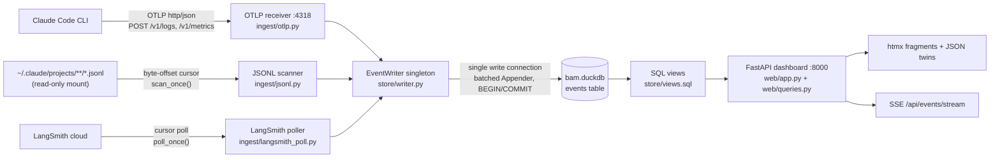
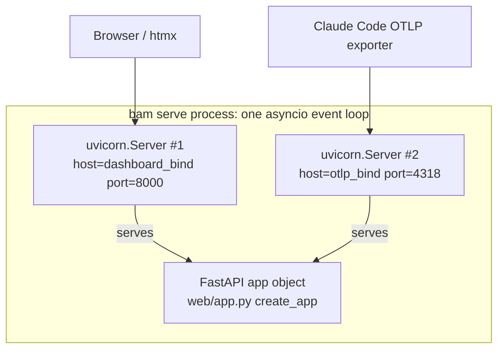

# Architecture

`boss-ai-monitoring` (`bam`) is a single-user, single-host observability app: three ingest
sources write a canonical event stream into one DuckDB file; SQL views summarize it; one FastAPI
app serves it as an htmx dashboard. This document covers the data flow, the serving model, the
event envelope, the key design decisions and their tradeoffs, and the concurrency invariant that
protects the single write connection.

Source of truth for anything below: `src/boss_ai_monitoring/{config.py,cli.py,store/,ingest/,web/}`.
The spec (`specs/boss-ai-monitoring/boss-ai-monitoring.html`) is the canonical design record if
this document and the code ever disagree with each other — but this document is written from the
code as it stands, not from the spec's original intent.

## Data flow



Three producers (`ingest/otlp.py`, `ingest/jsonl.py`, `ingest/langsmith_poll.py`) each translate
their source format into the same canonical event shape and call `store.writer.get_writer()` —
a process-wide singleton — to buffer and flush it. Every row lands in one table (`events`) tagged
with its `source` (`otlp` | `jsonl` | `langsmith` | `jobs`), so a number's provenance is always
answerable from the row itself. Reads never touch the producers: the dashboard, the trailing jobs,
and the marimo notebook all read `events` and the views built on top of it via
`store.writer.connect_read_only()`.

> **All three sources run automatically.** `cli.py::_serve_both` starts the two uvicorn `Server`
> instances *plus* three supervised background tasks: `ingest/jsonl.py::run_forever` (transcript
> scan), `ingest/langsmith_poll.py::run_forever` (cursor poll), and
> `jobs/scheduler.py::JobScheduler.run_forever` (trailing quality jobs). The servers are the
> foreground work; when they exit, the background tasks are cancelled.
>
> Two properties this wiring must preserve, both learned the hard way:
>
> 1. **Blocking work runs off the event loop.** `scan_once` is synchronous and takes minutes on a
>    first backfill over a real `~/.claude/projects`. Awaited inline it froze the entire app —
>    dashboard, OTLP receiver and SSE — for the duration. It now runs via `asyncio.to_thread`, as
>    do the synchronous DuckDB job callables in the scheduler.
> 2. **A dead loop must not kill the server.** Ingest is best-effort: a LangSmith outage or a
>    malformed transcript degrades the *data*, never the dashboard. Each task is wrapped in a
>    supervisor that logs and lets the servers keep running.
>
> The LangSmith poller starts only when `ingest.langsmith_project` is set
> (`BAM_INGEST__LANGSMITH_PROJECT`); with no project configured it logs and stays down rather than
> failing.

## Serving model



There is exactly **one** `FastAPI` app object, built once by `web/app.py::create_app(settings)`.
`cli.py::build_app` resolves it at runtime via `importlib` rather than a static import, because
`web/app.py` is owned by a different pane than `cli.py` in the multi-agent build and did not exist
during the scaffold wave — a `ModuleNotFoundError` there falls back to a loud placeholder app with
only `/healthz`, never a silent one.

`cli.py::_serve_both` wraps that one app object in **two** `uvicorn.Server` instances — one bound
to `server.dashboard_bind:dashboard_port` (default `127.0.0.1:8000`), one to
`server.otlp_bind:otlp_port` (default `127.0.0.1:4318`) — and runs both with `asyncio.gather` in a
single event loop started by one `asyncio.run(_serve_both(...))` call. The OTLP router
(`ingest/otlp.py::get_router()`) is mounted into the same app object inside `create_app`, under the
`# otlp-mount` marker — so `POST /v1/logs` answers on **both** ports, but in practice only the
`:4318` bind is where Claude Code's OTel exporter is pointed. Port wiring is centralized: no module
other than `cli.py` constructs a `uvicorn.Config`.

## The canonical event envelope

Every ingested fact, regardless of source, is normalized to one row in the `events` table
(`store/schema.py::EVENT_COLUMNS`, `store/writer.py:32` for the row-building logic):

| Column | Type | Purpose |
|---|---|---|
| `event_id` | `VARCHAR` (PK) | Deterministic id — the writer's idempotency key (see below) |
| `ts` | `TIMESTAMP` | Event time, UTC wall-clock, always pinned via `schema.py::pin_utc` |
| `source` | `VARCHAR` | `otlp` \| `jsonl` \| `langsmith` \| `jobs` — provenance |
| `event_type` | `VARCHAR` | e.g. `api_request`, `tool_result`, `user_prompt`, `metric`, `langsmith_run`, `job_run` |
| `session_id` | `VARCHAR` | Claude Code session |
| `prompt_id` | `VARCHAR` | One user prompt = one task |
| `request_id` | `VARCHAR` | API request id — the OTel/JSONL cost dedupe key |
| `model` | `VARCHAR` | Model name |
| `git_sha` | `VARCHAR` | Repo state at event time |
| `agent_name` / `skill_name` | `VARCHAR` | Attribution dimensions |
| `tool_name` | `VARCHAR` | Set on `tool_result` events |
| `cost_usd` | `DOUBLE` | Present when the source reports cost |
| `duration_ms` | `BIGINT` | |
| `tokens_input` / `tokens_output` / `tokens_cache_read` / `tokens_cache_creation` | `BIGINT` | Four token classes, tracked separately |
| `success` | `BOOLEAN` | Tool/run outcome |
| `cwd` | `VARCHAR` | Working directory, used for the "project" cost-attribution dimension |
| `payload` | `JSON` | Everything the fixed columns don't capture |

### Why a JSON `payload` column

The three sources are not schema-stable. `~/.claude/projects/**/*.jsonl` is, by
`ingest/jsonl.py`'s own docstring, "a reverse-engineered format that shifts across Claude Code
versions" with no published schema. OTel attribute sets grow as Claude Code adds telemetry. Rather
than migrating the `events` table's columns every time a new attribute or entry type appears, each
producer maps a small, known set of fields onto the fixed columns above
(`ingest/otlp.py::_ATTR_TO_COLUMN`) and puts *everything else* into `payload` untouched. An
event type nobody has written a column mapping for yet — `_empty_event`'s default in `otlp.py`, or
an unrecognized OTel attribute key — is still fully preserved, just not indexed as a top-level
column. Several existing views already read out of `payload` this way rather than promoting fields
to columns: `v_five_metrics` reads `payload->>'$.source'` for `tool_decision` events, and
`get_provenance_footer` (`web/queries.py:191`) reads `job_run` status straight out of `payload`.
New event types cost zero migrations; they just aren't queryable via a dedicated column until
someone decides they're worth one.

## Key design decisions and their tradeoffs

### Single DuckDB file, single writer connection

`store/writer.py`'s module docstring is explicit: `EventWriter` is "THE single write connection to
the DuckDB file (G5). Nobody else opens one." `store.writer.get_writer(settings)` is a
process-wide singleton keyed by resolved `db_path`, shared across the OTLP route handler, the
JSONL scanner, and the LangSmith poller (`store/writer.py:236`). Everything else — the dashboard,
the trailing jobs, the marimo notebook, tests — reads through
`store.writer.connect_read_only(db_path)`, which never opens a second read-write connection.

**Tradeoff:** this buys simplicity (no connection pool, no write conflicts, no separate metrics
pipeline — the views in `store/views.sql` are just SQL over the same table) at the cost of DuckDB's
file-locking behavior becoming a hard operational constraint (next section).

### DuckDB's file lock is exclusive, cross-process

Once `bam serve` has written anything, DuckDB holds an **exclusive** lock on the file — not a
reader/writer lock. A second, independent process (a bare `duckdb` CLI invocation, a standalone
`marimo` session) that tries to open the same file, even with `-readonly`, fails with
`IO Error: Could not set lock on file ...`. `store/writer.py::connect_read_only` works around this
*in-process* by handing back a `.cursor()` off the live writer's own connection when one exists —
cursors support concurrent MVCC reads without contending for the file lock — but that trick is only
available to code running inside the same Python process as the writer. An external tool has no
such option.

The writer is created **lazily**: `get_writer()` only opens a connection the first time something
calls it, so an idle `bam serve` (no events flushed yet) holds no lock at all. The lock only
appears after the first flush.

**The fix is `bam snapshot`, not stopping the app.** `EventWriter.snapshot_to()`
(`store/writer.py:142`) uses `ATTACH` + `COPY FROM DATABASE` to produce a transactionally-consistent
copy — schema, tables, *and* views — of the live file, flushing any buffered-but-unflushed events
first so the snapshot never silently omits the newest rows. `bam snapshot` (`cli.py::_cmd_snapshot`)
asks the running app for one over HTTP (`POST /api/snapshot`); if nothing answers, it opens a
short-lived standalone writer and snapshots in-process instead — so the same command works whether
or not `bam serve` is up.

### JSONL-derived costs are estimates, excluded when an OTel cost exists

`ingest/jsonl.py` parses `~/.claude/projects/**/*.jsonl`, a best-effort reverse-engineered format,
for backfill and gap-fill. Its costs are not authoritative. `store/views.sql::v_cost_events` — the
view every cost-bearing view (`v_sessions`, `v_tasks`, `v_costs_daily`, `v_attribution`) is built
on — excludes a `source = 'jsonl'` row whenever an `source = 'otlp'` row exists with the **same
`request_id` AND the same `session_id`** (`IS NOT DISTINCT FROM`, so two `NULL` session_ids don't
falsely match against an unrelated pair). The join key is deliberately `request_id`, not
`prompt_id`: one prompt can span multiple API requests (retries, multi-turn tool loops), so
`prompt_id` alone would under-deduplicate. OTel is treated as the authoritative cost source; JSONL
fills the gaps OTel didn't cover (e.g. the OTLP receiver was down) and yields whenever OTel already
answered.

### OTLP is http/json only

`ingest/otlp.py`'s module docstring: "G1: http/json only, wherever the app is bound (no gRPC, no
otel-collector, ever)." `POST /v1/logs` and `POST /v1/metrics` parse the OTLP JSON export shape
(`resourceLogs -> scopeLogs -> logRecords`, and the metrics equivalent) directly — there is no
gRPC listener and no intermediate collector process. This keeps the ingest surface to two plain
HTTP routes with no protobuf toolchain, at the cost of not accepting OTLP/gRPC exporters.

### Localhost bind, no auth, by design

`ServerSettings` defaults both binds to `127.0.0.1`. There is no authentication anywhere in
`web/app.py`. This is a stated design constraint (single-user, trusted-network scope), not a gap:
see the `POST /api/snapshot` discussion in `docs/API.md` for why "it only binds localhost" is
explicitly *not* treated as license to add a caller-controlled file-write endpoint. In Docker, both
binds move to `0.0.0.0` (`compose.yaml`) because Docker's port publishing lands on the container's
external interface, not loopback — the trust boundary shifts to "whoever can reach the published
ports," which `compose.yaml`'s comments call out explicitly.

## Concurrency invariant: `flush()` holds its lock across the whole DB round-trip

`EventWriter` is shared, without external synchronization, across three concurrent producers: the
OTLP route handler (an async request), the JSONL scanner's periodic pass, and the LangSmith
poller's periodic pass. `EventWriter.flush()` (`store/writer.py:98`) protects this with a single
`threading.Lock`, and the load-bearing detail is *what* it protects:

```python
def flush(self) -> int:
    with self._lock:
        batch = self._buffer
        self._buffer = []
        self._last_flush = time.monotonic()
        if not batch:
            return 0
        return self._flush_batch(batch)   # BEGIN TRANSACTION ... COMMIT, still inside the lock
```

The lock is held from the buffer swap all the way through `_flush_batch`'s `BEGIN TRANSACTION` /
`INSERT ... SELECT ... WHERE NOT EXISTS` / `COMMIT` sequence against the one shared `duckdb`
connection — not released after the swap and reacquired for the DB work. The writer's own comment
names the failure mode this prevents: releasing the lock before `_flush_batch` "let two threads
both pass the swap and then race `BEGIN TRANSACTION` on the one connection" — a single DuckDB
connection is not safe for concurrent transactions from multiple threads, so two overlapping
`BEGIN`s on it corrupts the transaction, not just the data. `snapshot_to()` (`store/writer.py:142`)
follows the identical pattern for the same reason: it flushes any buffered events and performs its
`ATTACH` / `COPY FROM DATABASE` / `DETACH` sequence all under the same `self._lock`, because a
snapshot mid-write would otherwise race the next producer's flush.

The practical cost of this is that all three producers serialize on every flush — the design
accepts that in exchange for a single DuckDB connection with no external connection-pooling
library and no risk of two half-finished transactions interleaving on it.
