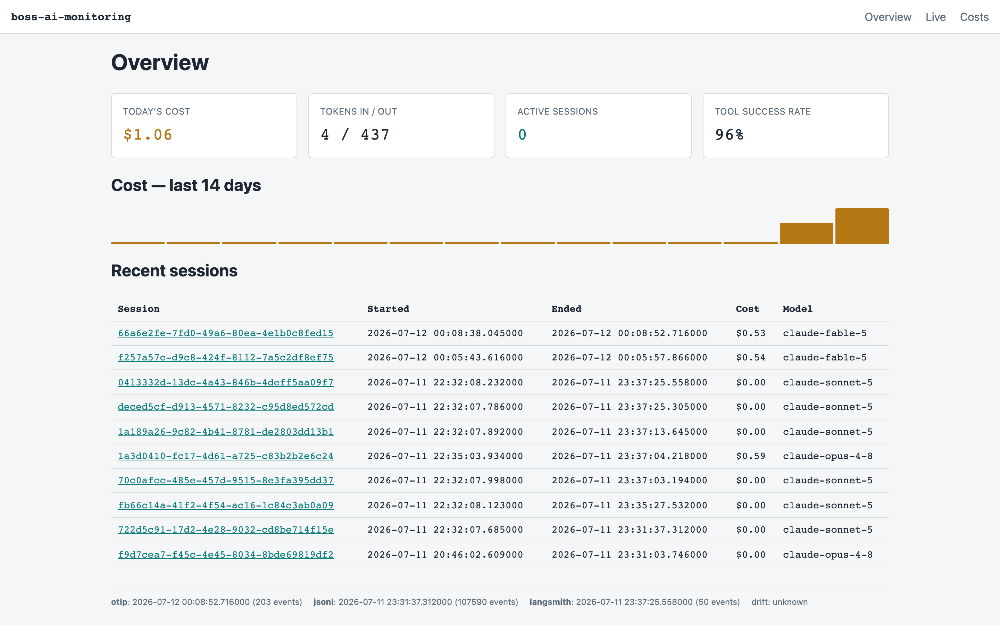
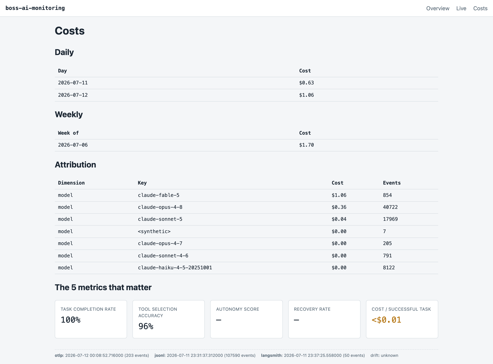
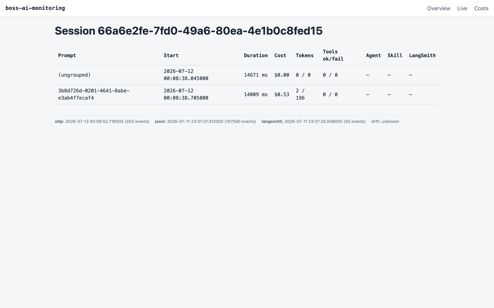
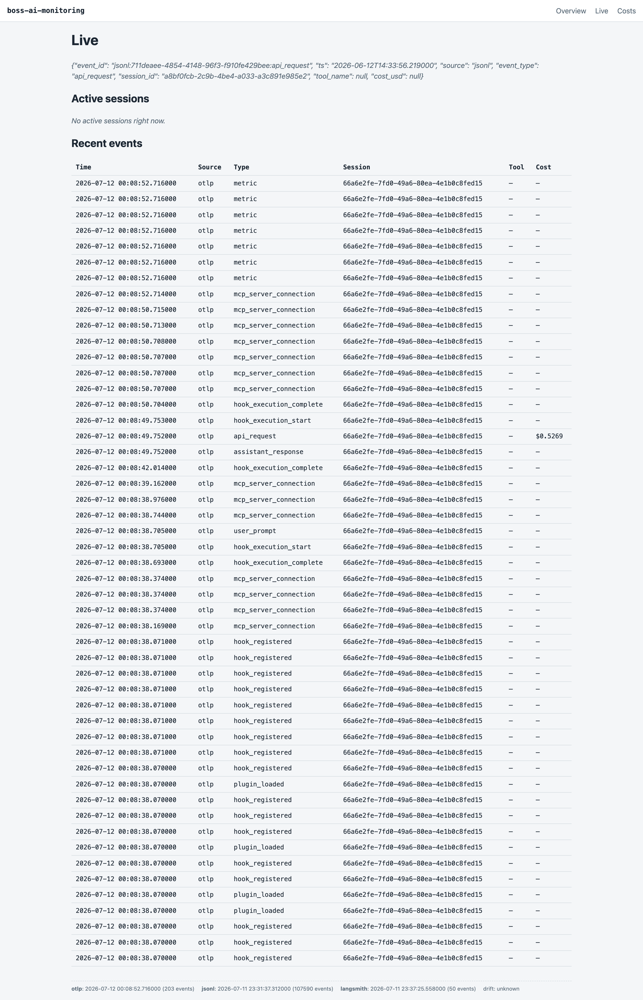
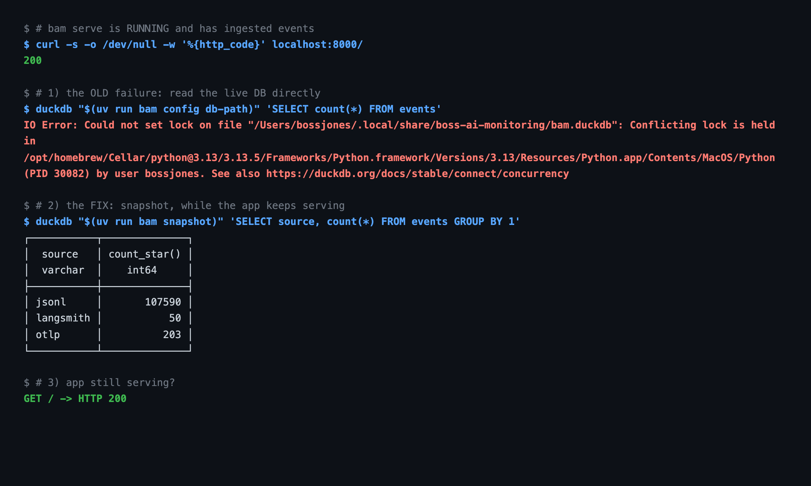
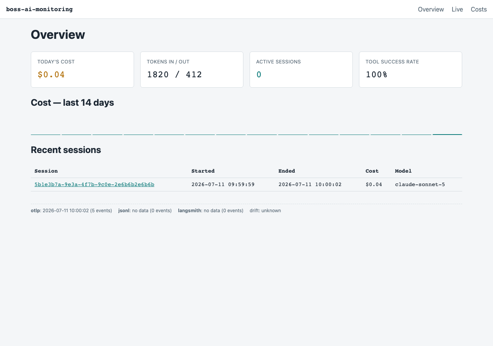
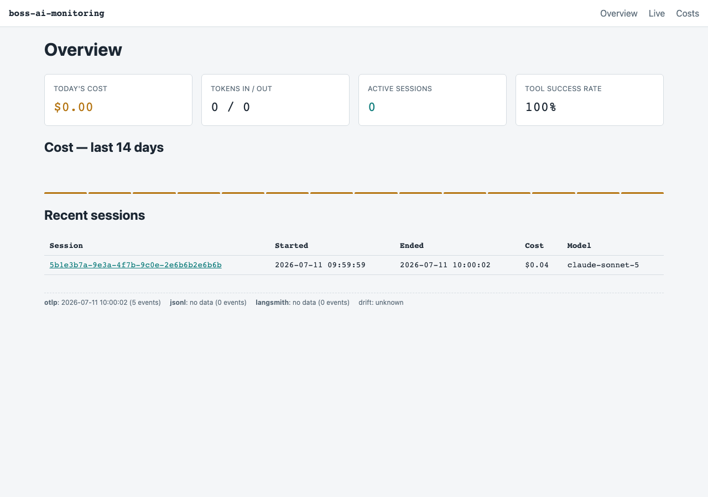

# Proof — what actually works

Every image here was captured from the **live app against the real database**, not a fixture-seeded
stand-in. Regenerate them yourself:

```bash
uv run bam serve                                 # terminal 1
uv run python scripts/capture_screenshots.py     # terminal 2
```

The capture script refuses to quietly produce a pretty, empty page: it prints `LOOKS EMPTY` for any
route that renders without content, and skips the session-detail shot entirely rather than faking
one if the database has no sessions.

---

## The dashboard, on real data

### Overview — `/`



Stat tiles, a 14-day cost sparkline, and recent sessions. The sessions in this shot are the
**7-pane cmux team that built this repo** — `claude-opus-4-8` (the lead) and `claude-sonnet-5` (the
workers). The tool is monitoring its own construction.

The provenance footer is the important part: `otlp: 203 events · jsonl: 107590 events ·
langsmith: 50 events`. All three ingest sources are live, and every panel says where its data came
from and how fresh it is.

### Costs — `/costs`



Daily and weekly rollups, cost attribution per model, and "the 5 metrics that matter".

Two honest caveats visible in this shot:

- **Autonomy Score and Recovery Rate render as `—`.** They are `NULL` because this dataset contains
  no `tool_decision` or `api_error` events. That is the correct behavior — the tool shows nothing
  rather than inventing a number.
- **Cost / successful task** was rendering as `$0.00` when the true value was `$0.00042`. A
  monitoring tool reporting a non-zero cost as zero is a lie, so sub-cent values now render as
  `<$0.01`. The underlying metric is still diluted (cost comes only from OTel events, but the task
  count spans the whole JSONL history) — tracked in [`specs/outstanding.md`](../specs/outstanding.md).

### Session detail — `/sessions/{id}`



Per-task timeline for one session: prompt, duration, cost, tokens, tool ok/fail, LangSmith
deep-link.

### Live — `/live`



SSE feed and active-session cards. Events appear here as they arrive, without a page reload.

---

## `bam snapshot` — query the database while the app is running

This is the one image that proves the feature, because it shows the failure *and* the fix in the
same breath:



1. `bam serve` is up and has ingested events (`HTTP 200`).
2. Reading the live DuckDB file directly **fails**: `IO Error: Could not set lock on file … by user
   bossjones`. DuckDB's file lock is exclusive *cross-process*.
3. `duckdb "$(uv run bam snapshot)" …` **succeeds**, returning all three sources.
4. The app is **still serving** (`GET / -> HTTP 200`). Nothing was stopped.

Note the lazy-writer subtlety: an *idle* `bam serve` holds no lock at all, so a direct read can
appear to work right up until the first event lands. That is exactly the kind of intermittent
failure that would have been miserable to debug in the wild.

---

## The frontend agent loop (Phase 7)




One real screenshot → critique → edit → reload iteration, written up in
[`AGENT_LOOP.md`](AGENT_LOOP.md) with the design tokens in
[`design-tokens.md`](design-tokens.md).

---

## Verification, reproducible

```bash
just check      # ruff + ruff format + pyrefly (0 errors) + codespell + full pytest
```

CI runs exactly this on every push, and it is green on `main`.
